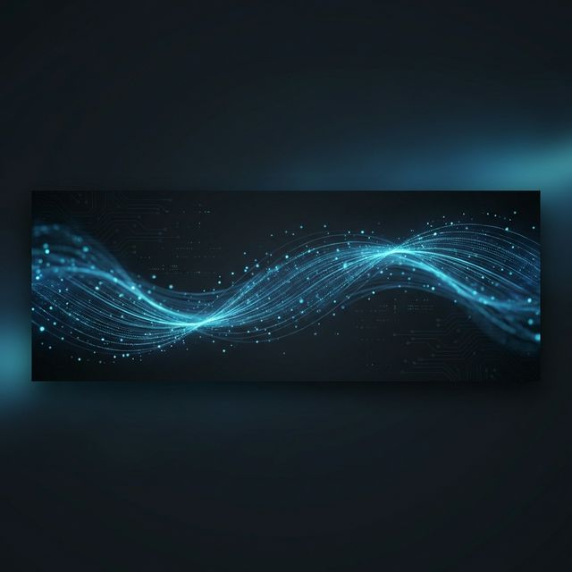

# 🌊 Deras Download Manager

<p align="center">
  
</p>

**Deras** (Indonesian for _Swift/Fast Flow_) is a high-performance, modern download manager designed for speed, efficiency, and a seamless cross-platform experience. Built with **Rust**, **Tauri 2**, and **Svelte 5**, it offers a premium desktop feel on Linux, Windows, macOS, and Mobile.



## ✨ Key Features

- **🚀 Performance-First Engine**: Written in Rust for maximum efficiency and multi-threaded throughput.
- **📥 Protocol Support**:
  - **HTTP/HTTPS**: High-speed multi-connection downloads.
  - **BitTorrent**: Full support for `.torrent` files and `magnet:` links (powered by `librqbit`).
- **🕒 Smart Scheduler**: Define bandwidth-friendly download windows.
- **🛡️ Site Manager**: Securely store and manage credentials for authenticated downloads.
- **⚡ Bandwidth Throttling**: Global and per-task speed limits.
- **📂 Auto-Categorization**: Intelligent file sorting (Video, Audio, Documents, etc.).
- **🔌 Browser Integration**: Manifest V3 extension for seamless download interception.
- **📝 Detailed Logging**: Real-time event tracking for every download.
- **📱 Cross-Platform**: Premium native experience on Linux, Windows, macOS, Android, and iOS.

## 🛠️ Technology Stack

- **Frontend**: [Svelte 5 (Runes)](https://svelte.dev/), [Tailwind CSS](https://tailwindcss.com/), [shadcn-svelte](https://shadcn-svelte.com/).
- **Backend**: [Rust](https://www.rust-lang.org/), [Tauri 2](https://tauri.app/).
- **Networking**: [reqwest](https://github.com/seanmonstar/reqwest), [tokio](https://tokio.rs/).
- **Package Manager**: [bun](https://bun.sh/).

## 🚀 Getting Started

### Prerequisites

- [Rust](https://www.rust-lang.org/tools/install)
- [Node.js](https://nodejs.org/) & [bun](https://bun.sh/)
- [Tauri dependencies](https://tauri.app/v2/guides/getting-started/prerequisites/)

### Installation

1. **Clone the repository**:

   ```bash
   git clone https://github.com/HasanH47/deras.git
   cd deras
   ```

2. **Install dependencies**:

   ```bash
   bun install
   ```

3. **Run in development mode**:

   ```bash
   bun run dev
   ```

4. **Build for production**:
   ```bash
   bun run tauri build
   ```

## 🤝 Contributing

Contributions are welcome! Please feel free to submit a Pull Request.

## 📄 License

This project is licensed under the MIT License - see the [LICENSE](LICENSE) file for details.
